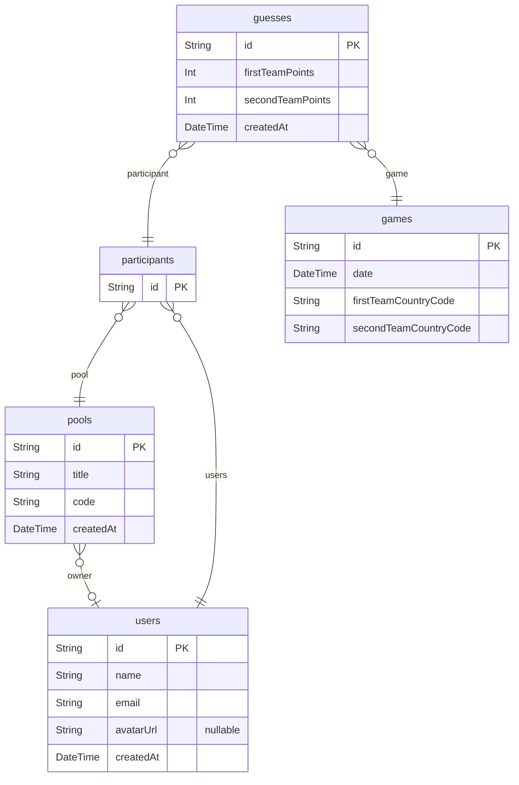

```mermaid
erDiagram

  pools {
    String id PK 
    String title  
    String code  
    DateTime createdAt  
    }
  

  participants {
    String id PK 
    }
  

  users {
    String id PK 
    String name  
    String email  
    String avatarUrl  "nullable"
    DateTime createdAt  
    }
  

  games {
    String id PK 
    DateTime date  
    String firstTeamCountryCode  
    String secondTeamCountryCode  
    }
  

  guesses {
    String id PK 
    Int firstTeamPoints  
    Int secondTeamPoints  
    DateTime createdAt  
    }
  
    pools o{--|o users : "owner"
    participants o{--|| users : "users"
    participants o{--|| pools : "pool"
    guesses o{--|| participants : "participant"
    guesses o{--|| games : "game"
```
